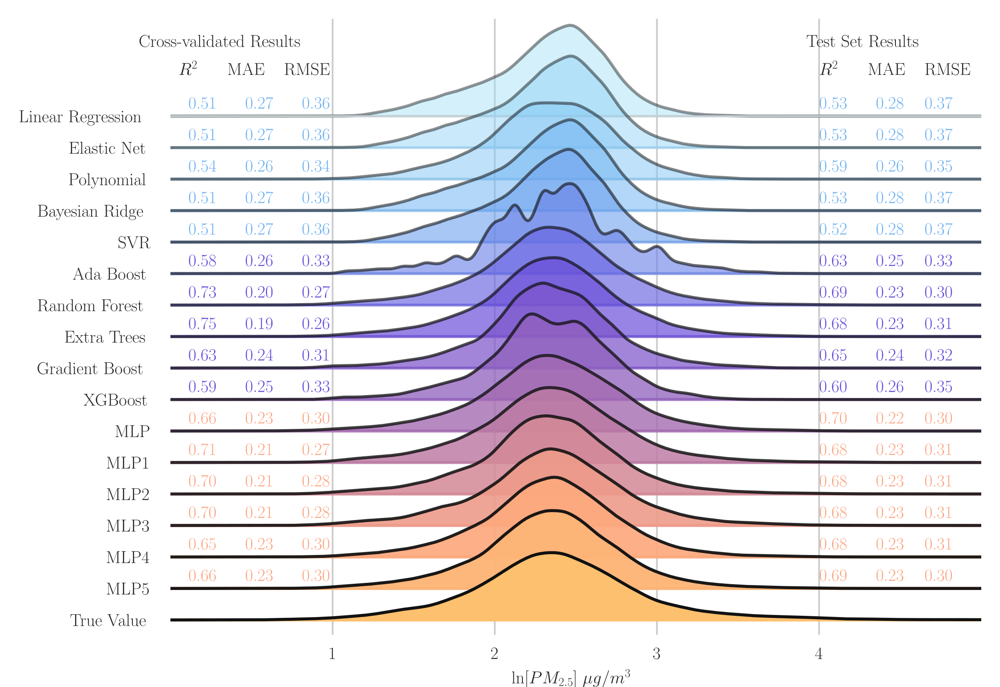

# Machine learning and Air Quality

## Model Comparison

I focus on the use of machine learning to estimate a harmful component of air quality: particulate matter smaller than 2.5 micrometers, or PM2.5.
The first part of my research has focused on comparing several machine learning algorithms when estimating ground level PM2.5 concentrations. Why?
Well, because my advisor told me to for one, but also because you have to start somewhere in grad school. This allowed me to learn many, many machine learning
algorithms. And, it was kinda fun.

This was all done with data from [MERRA-2](https://gmao.gsfc.nasa.gov/reanalysis/MERRA-2/), using synthetic data, the most important component of which was the simulated aerosol optical depth, or AOD. We focused on 10 yeras of data, but only over Texas.

## But now more focused and using real data

My second year of research is now focusing on doing a more targeted comparison, but for the entire United States and using data from [GOES-16](https://www.goes-r.gov/multimedia/dataAndImageryImagesGoes-16.html). This is ongoing.